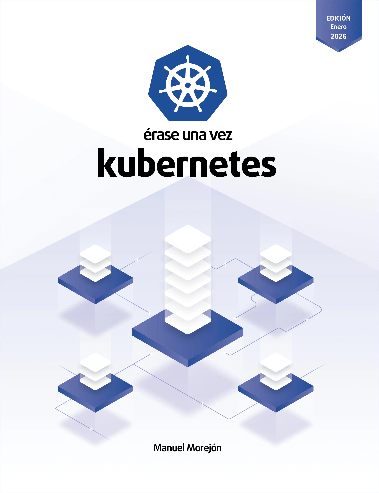

# erase-una-vez-4

[](README.md)

<div align="center">



This repository is a practical example created for the book **"Once Upon a Time Kubernetes"**.

👇 **Get the updated 2026 edition here:** 👇

[](https://www.amazon.es/dp/B0F9VPCJ7X)
[](https://leanpub.com/once-upon-a-time-kubernetes)

</div>

---

## Description

The application queries the number of Pods existing in the Namespace and prints a message with this information on the console.

It is a simple example used in the chapter *Role Base Access Control* to show how to assign permissions to a Pod.

## Environment variables

The application can be modified through environment variables:

|Environment variable|Description|Default value|
|-------------------|-----------|-----------------|
|`NAMESPACE` | Modifies the namespace where the Pods will be queried.      | `default` |
|`SLEEP_TIME`| Modifies the time interval between messages. In seconds.| 5 |

## Deployment in Kubernetes

Create namespace `admin`.

```sh
kubectl apply -f kubernetes/namespace.yaml

namespace/admin created
```

Create the ServiceAccount, Role, RoleBinding and Deployment objects.

```sh
kubectl apply -f kubernetes/

deployment.apps/app created
namespace/admin unchanged
role.rbac.authorization.k8s.io/developer created
rolebinding.rbac.authorization.k8s.io/developer created
serviceaccount/developer created
```

Check the logs of the deployed App.

```sh
kubectl -n admin logs -l app=rbac --follow

Existen 0 pods en el namespace default
Existen 0 pods en el namespace default
Existen 0 pods en el namespace default
```

---

## 🤝 Community and Feedback

1.  ⭐ **Has this been useful to you?** Give a **star** to the repository (top right). It helps us reach more engineers.
2.  📚 **Still don't have the book?** Buy the book on Amazon or Leanpub.

<div align="center">
    <a href="https://www.amazon.es/dp/B0F9VPCJ7X">
        
    </a>
</div>
